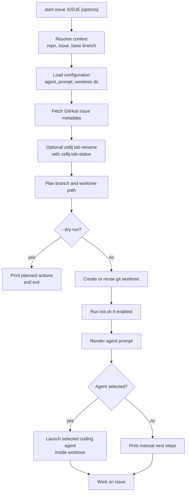

# start-issue

[](https://github.com/dapi/start-issue/actions/workflows/ci.yml)

[Русская версия](README.ru.md)

Turn a GitHub issue into a dedicated branch, git worktree, and coding-agent session.

`start-issue` turns issue context into a repeatable workflow:

1. issue -> branch
2. branch -> worktree
3. worktree -> agent session

It fetches issue metadata with `gh`, creates a git worktree with a branch name based on the issue, optionally runs `init.sh`, optionally renames the current zellij tab, and starts a configurable coding agent session.

## Install

```bash
make install
```

This installs `scripts/start-issue` to `~/.local/bin/start-issue`.

Make sure `~/.local/bin` is in your `PATH`.

## Usage

```bash
start-issue 123
start-issue https://github.com/owner/repo/issues/123
start-issue 123 --repo owner/repo --base develop
start-issue 123 --agent codex
start-issue 123 --agent kimi --prompt-file .start-issue/prompt.md
start-issue 123 --no-agent
start-issue 123 --dry-run
```

## Workflow



## CLI Arguments

| Argument | Description |
|----------|-------------|
| `ISSUE` | GitHub issue number or full GitHub issue URL. Required. |
| `--repo OWNER/REPO`, `-r OWNER/REPO` | Repository to read the issue from when `ISSUE` is a number. If omitted, `start-issue` detects the repository from `origin`. |
| `--base BRANCH`, `-b BRANCH` | Base branch for the new worktree branch. If omitted, `start-issue` uses the repository default when available, otherwise the current branch. |
| `--worktree-dir DIR`, `-w DIR` | Parent directory for created worktrees. Overrides `START_ISSUE_WORKTREE_DIR`. |
| `--flat` | Use a flat worktree path by replacing `/` in the branch name with `-`. |
| `--agent AGENT` | Agent to launch after preparing the worktree. Supported: `claude`, `codex`, `kimi`, `pi`, `none`. |
| `--no-agent` | Prepare the worktree and print manual next steps without launching an agent. Alias for `--agent none`. |
| `--no-claude` | Compatibility alias for `--no-agent`. |
| `--prompt TEXT` | Inline prompt template for the selected agent. Mutually exclusive with `--prompt-file`. |
| `--prompt-file PATH` | Prompt template file for the selected agent. Mutually exclusive with `--prompt`. |
| `--no-init` | Do not run `init.sh` even if it exists in the created worktree. |
| `--command COMMAND`, `-c COMMAND` | Claude command prefix used by the default Claude prompt. Default: `/task-router:route-task`. |
| `--ai` | Ask the selected agent to generate the branch name. Falls back to the local branch-name heuristic if generation fails. |
| `--dry-run` | Print the selected configuration and launch command without creating a worktree, running `init.sh`, or launching an agent. |
| `--version`, `-v` | Show version. |
| `--help`, `-h` | Show help. |

Detailed per-agent examples are in [docs/agent-examples.md](docs/agent-examples.md).

Related Claude Code marketplace workflows:

- [task-router](https://github.com/dapi/claude-code-marketplace/tree/master/task-router)
- [zellij-workflow](https://github.com/dapi/claude-code-marketplace/tree/master/zellij-workflow)

## Environment Variables

| Variable | Description |
|----------|-------------|
| `START_ISSUE_AGENT` | Default agent when `--agent` is not provided and no config file sets an agent. Supported: `claude`, `codex`, `kimi`, `pi`, `none`. Built-in default: `claude`. |
| `START_ISSUE_PROMPT` | Inline prompt template used when no CLI or config prompt is provided. Mutually exclusive with `START_ISSUE_PROMPT_FILE` when the environment prompt is active. |
| `START_ISSUE_PROMPT_FILE` | Prompt template file used when no CLI or config prompt is provided. Mutually exclusive with `START_ISSUE_PROMPT` when the environment prompt is active. |
| `START_ISSUE_WORKTREE_DIR` | Default parent directory for created worktrees when `--worktree-dir` is not provided. Built-in default: `~/worktrees`. |
| `START_ISSUE_DUMP_PROMPT` | When set to `1`, dry-run output includes the full rendered prompt instead of only summary information. |

## Configuration Files

| File | Description |
|------|-------------|
| `.start-issue/agent` | Project default agent. Read from the git root. |
| `.start-issue/prompt.md` | Project default prompt template. Read from the git root. |
| `~/.config/start-issue/agent` | User default agent. |
| `~/.config/start-issue/prompt.md` | User default prompt template. |

Configuration precedence:

1. CLI arguments
2. Project config
3. User config
4. Environment variables
5. Built-in defaults

Claude uses the plugin-native command by default:

```text
/task-router:route-task {ISSUE_URL}
```

Other agents use a portable prompt by default.

Prompt templates support:

```text
{ISSUE_URL}
{ISSUE_NUMBER}
{ISSUE_TITLE}
{ISSUE_BODY}
{ISSUE_LABELS}
{REPO}
{BRANCH_NAME}
{WORKTREE_PATH}
{BASE_BRANCH}
```

Unknown placeholders are left unchanged.

## Zellij Support

If [`zellij-tab-status`](https://github.com/dapi/zellij-tab-status) is available in `PATH`, `start-issue` renames the current Zellij tab to `#ISSUE_NUMBER` with `zellij-tab-status --set-name` after the issue is fetched.

This step is optional. Missing `zellij-tab-status` is ignored, and a rename failure is reported as a warning without stopping the workflow.

Optional dependency for Zellij support:

- [`zellij-tab-status`](https://github.com/dapi/zellij-tab-status)

## Requirements

- `bash`
- `git`
- `gh` CLI with authenticated GitHub session
- `jq`
- selected agent CLI unless `--agent none` or `--dry-run` is used

## Specification

The script specification is in [doc/spec.md](doc/spec.md).

## License

MIT
