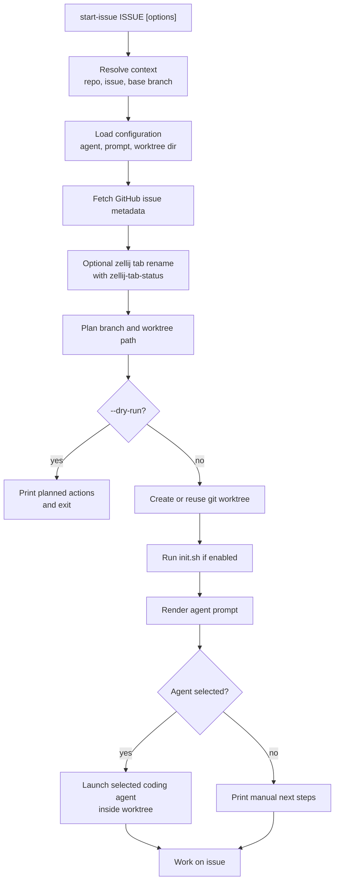

# start-issue

[](https://github.com/dapi/start-issue/actions/workflows/ci.yml)

[Русская версия](README.ru.md)

Turn a GitHub issue into a dedicated branch, git worktree, and coding-agent session.

`start-issue` turns issue context into a repeatable workflow:

1. issue -> branch
2. branch -> worktree
3. worktree -> agent session

It fetches issue metadata with `gh`, creates a git worktree with a branch name based on the issue, optionally runs `init.sh`, optionally renames the current zellij tab, and starts a configurable coding agent session.

## Install

Install the latest published release:

```bash
curl -fsSL https://raw.githubusercontent.com/dapi/start-issue/master/install.sh | bash
```

The installer downloads the latest GitHub Release asset into `~/.local/bin/start-issue` by default.

For developer diagnostics on a machine where the install appears to hang:

```bash
curl -fsSL https://raw.githubusercontent.com/dapi/start-issue/master/install.sh | bash -s -- --debug
```

This enables shell tracing plus verbose `curl` or `wget` output so you can see which step is blocking.

Manual install:

```bash
mkdir -p ~/.local/bin
curl -fsSL https://github.com/dapi/start-issue/releases/latest/download/start-issue -o ~/.local/bin/start-issue
chmod +x ~/.local/bin/start-issue
```

Verify the download if you want:

```bash
tmpdir="$(mktemp -d)"
curl -fsSL https://github.com/dapi/start-issue/releases/latest/download/start-issue -o "$tmpdir/start-issue"
curl -fsSL https://github.com/dapi/start-issue/releases/latest/download/start-issue.sha256 -o "$tmpdir/start-issue.sha256"
(cd "$tmpdir" && shasum -a 256 -c start-issue.sha256)
```

Build and install from source:

```bash
make install
```

This builds a self-contained `start-issue` script from the modular sources and installs it to `~/.local/bin/start-issue`.

Make sure `~/.local/bin` is in your `PATH`.

Update an existing installation to the latest published GitHub Release:

```bash
start-issue update
start-issue --update
```

The update workflow resolves the latest GitHub Release for `dapi/start-issue`,
compares it with the running executable version, and updates the same
executable path when a newer release exists. If the installed version is
already current, the command exits successfully with a clear no-op message.

## Usage

```bash
start-issue 123
start-issue https://github.com/owner/repo/issues/123
start-issue 123 --repo owner/repo --base develop
start-issue 123 --agent codex
start-issue 123 --agent codex --model gpt-5.2
start-issue 123 --agent codex --human-gate
start-issue 123 --agent kimi --prompt-file .start-issue/prompt.md
start-issue 123 --no-agent
start-issue 123 --dry-run
start-issue setup
start-issue --setup
start-issue init
start-issue init --project --agent codex --model gpt-5.2
start-issue update
start-issue --update
start-issue --human-gate-help
```

Running `start-issue` without an issue prints the normal help plus the currently
selected agent, selected model, prompt source, and prompt location, then exits
without contacting GitHub.

## Workflow


```mermaid
flowchart TD
    A["start-issue ISSUE [options]"] --> B["Resolve context<br/>repo, issue, base branch"]
    B --> C["Load configuration<br/>agent, prompt, worktree dir"]
    C --> D["Fetch GitHub issue metadata"]
    D --> Z["Optional zellij tab rename<br/>with zellij-tab-status"]
    Z --> E["Plan branch and worktree path"]
    E --> F{"--dry-run?"}

    F -- yes --> G["Print planned actions<br/>and exit"]
    F -- no --> H["Create or reuse git worktree"]

    H --> I["Run init.sh if enabled"]
    I --> J["Render agent prompt"]
    J --> K{"Agent selected?"}

    K -- yes --> L["Launch selected coding agent<br/>inside worktree"]
    K -- no --> M["Print manual next steps"]

    L --> N["Work on issue"]
    M --> N
```

## Internal Architecture

The CLI entrypoint remains `scripts/start-issue`, but the implementation is now split into focused shell modules under `scripts/lib/start_issue/`.
`make build` and `make install` bundle those modules back into a single-file script for distribution and local installation.

- `cli.sh` parses arguments and normalizes flags into workflow state.
- `config.sh` resolves agent, model, and prompt configuration.
- `github.sh` resolves repository context and fetches issue metadata.
- `worktree.sh` plans branch/worktree behavior and runs worktree-side effects.
- `agent.sh` owns agent adapter operations: validation, launch command construction, AI branch naming, and prompt improvement.
- `release.sh` owns release download, checksum, and version-normalization helpers shared by install and update paths.
- `update.sh` owns the self-update workflow and latest-release resolution.
- `output.sh` renders help, status, dry-run output, and session framing.
- `init.sh` owns `start-issue init` plus the user-config onboarding helpers behind `setup`.
- `pipeline.sh` makes the orchestration pipeline explicit.

The internal pipeline is now:

1. Parse input.
2. Resolve config.
3. Fetch issue.
4. Plan branch and worktree.
5. Execute the plan.
6. Launch the selected agent.

The project should keep Bash as long as lifecycle commands, configuration shape, and output needs stay simple enough for shell modules to remain readable. If future work requires nested configuration, richer subcommands such as `resume` or `cleanup`, or more structured machine-readable output, that should be treated as the threshold for evaluating a Python core.

## CLI Arguments

| Argument | Description |
|----------|-------------|
| `ISSUE` | GitHub issue number or full GitHub issue URL. Required. |
| `init` | Create default configuration files for either the current project or the current user. |
| `setup` | Run first-run onboarding for user config in `~/.config/start-issue`. |
| `update` | Update the running `start-issue` executable from the latest published GitHub Release. |
| `--repo OWNER/REPO`, `-r OWNER/REPO` | Repository to read the issue from when `ISSUE` is a number. If omitted, `start-issue` detects the repository from `origin`. |
| `--base BRANCH`, `-b BRANCH` | Base branch for the new worktree branch. If omitted, `start-issue` uses the repository default when available, otherwise the current branch. |
| `--worktree-dir DIR`, `-w DIR` | Parent directory for created worktrees. Overrides `START_ISSUE_WORKTREE_DIR`. |
| `--flat` | Use a flat worktree path by replacing `/` in the branch name with `-`. |
| `--agent AGENT` | Agent to launch after preparing the worktree. With `init`, the default agent to write. Supported: `claude`, `codex`, `kimi`, `pi`, `none`. |
| `--model MODEL` | Explicit model for the selected agent. With `init`, the model config to write. If omitted, built-in behavior stays unset and the selected agent CLI decides. |
| `--no-agent` | Prepare the worktree and print manual next steps without launching an agent. Alias for `--agent none`. |
| `--no-claude` | Compatibility alias for `--no-agent`. |
| `--prompt TEXT` | Inline prompt template for the selected agent. With `init`, the prompt template to write. Mutually exclusive with `--prompt-file`. |
| `--prompt-file PATH` | Prompt template file for the selected agent. With `init`, the file content to write. Mutually exclusive with `--prompt`. |
| `--improve-prompt` | Ask the selected agent to generate a reviewable improved prompt template proposal, then exit before creating a worktree. |
| `--human-gate` | Codex-only batch mode for issue work. Runs `codex exec`, exits on `STATUS: DONE`, and resumes the same session on `STATUS: HUMAN_GATE`. |
| `--human-gate-help` | Show dedicated help for the Codex human-gate workflow, including prompt contract, exit codes, and state files. |
| `--prompt-output-file PATH` | Proposal output path for `--improve-prompt`. |
| `--no-init` | Do not run `init.sh` even if it exists in the created worktree. |
| `--command COMMAND`, `-c COMMAND` | Claude command prefix used by the default Claude prompt. Default: `/task-router:route-task`. |
| `--ai` | Ask the selected agent to generate the branch name. Falls back to the local branch-name heuristic if generation fails. |
| `--project` | With `init`, write project config under `.start-issue` in the git root. |
| `--user` | With `init`, write user config under `~/.config/start-issue`. |
| `--force` | With `init`, overwrite existing `agent` and `prompt.md` files, and reset `model` to the selected value or to built-in unset when `--model` is omitted. Existing files are kept by default without `--force`. |
| `--dry-run` | Print the selected configuration and launch command without creating a worktree, running `init.sh`, or launching an agent. With `init`, print planned config writes without creating files. |
| `--setup` | Run the same user-config onboarding flow as `start-issue setup`. |
| `--update` | Update the running `start-issue` executable from the latest published GitHub Release. Equivalent to `start-issue update`. |
| `--version`, `-v` | Show version. |
| `--help`, `-h` | Show help. |

Detailed per-agent examples are in [docs/agent-examples.md](docs/agent-examples.md).

Related Claude Code marketplace workflows:

- [task-router](https://github.com/dapi/claude-code-marketplace/tree/master/task-router)
- [zellij-workflow](https://github.com/dapi/claude-code-marketplace/tree/master/zellij-workflow)

## Environment Variables

| Variable | Description |
|----------|-------------|
| `START_ISSUE_AGENT` | Default agent when `--agent` is not provided and no config file sets an agent. Supported: `claude`, `codex`, `kimi`, `pi`, `none`. Built-in default: `claude`. |
| `START_ISSUE_MODEL` | Default model when `--model` is not provided and no config file sets a model. Built-in default: unset, which lets the selected agent CLI decide. |
| `START_ISSUE_PROMPT` | Inline prompt template used when no CLI prompt is provided. It overrides project and user prompt files. Mutually exclusive with `START_ISSUE_PROMPT_FILE` when no CLI prompt is provided. |
| `START_ISSUE_PROMPT_FILE` | Prompt template file used when no CLI prompt is provided. It overrides project and user prompt files. Mutually exclusive with `START_ISSUE_PROMPT` when no CLI prompt is provided. |
| `START_ISSUE_WORKTREE_DIR` | Default parent directory for created worktrees when `--worktree-dir` is not provided. Built-in default: `~/worktrees`. |
| `START_ISSUE_DUMP_PROMPT` | When set to `1`, dry-run output includes the full rendered prompt instead of only summary information. |

## Configuration Files

| File | Description |
|------|-------------|
| `.start-issue/agent` | Project default agent. Read from the git root. |
| `.start-issue/model` | Project default model. Read from the git root when present. |
| `.start-issue/prompt.md` | Project default prompt template. Read from the git root. |
| `~/.config/start-issue/agent` | User default agent. |
| `~/.config/start-issue/model` | User default model. Read when present. |
| `~/.config/start-issue/prompt.md` | User default prompt template. |

Run `start-issue setup` or `start-issue --setup` for the friendly user-level onboarding flow. It works only with `~/.config/start-issue`, asks for the default agent (`claude`, `codex`, `kimi`, `pi`, or skip), shows the derived default prompt, and writes `prompt.md` only when the user confirms.

Run `start-issue init` for the existing manual initializer. If neither `--project` nor `--user` is provided, the command asks which scope to initialize. It writes the built-in default agent and prompt unless `--agent`, `--prompt`, or `--prompt-file` is provided. `--model` writes a sibling `model` file; when `--model` is omitted, built-in behavior stays unset and no new model file is created. If an existing `agent` file is kept without `--force`, the generated default prompt is chosen for that kept agent.

On an ordinary non-setup launch, if `~/.config/start-issue` does not exist yet, `start-issue` shows a compact first-run message and asks whether to run setup immediately. If the user declines, it still creates the empty `~/.config/start-issue` directory so the onboarding prompt is not shown again automatically.

## Self-Update

`start-issue update` and `start-issue --update` are equivalent entry points.

The workflow:

1. Resolves the latest published GitHub Release for `dapi/start-issue`.
2. Reads the version of the executable the user is currently running.
3. Normalizes version strings so `1.11.1` and `v1.11.1` compare as equal.
4. If the running version is current or newer than the latest published release, exits `0` with a clear status message.
5. If a newer published release exists, downloads `start-issue` and `start-issue.sha256`, verifies the checksum, and installs the update into the same executable path the user invoked.

The update workflow works outside a git repository. It requires `gh`, `jq`, and either `curl` or `wget`.

## Codex Human-Gate

`start-issue 123 --agent codex --human-gate` keeps the normal issue-start workflow through worktree creation, optional `init.sh`, and prompt rendering, but replaces the final interactive Codex launch with a resumable batch run.

The batch flow:

1. runs `codex exec` with JSON event output and a saved last-message file;
2. captures `thread_id` from the `thread.started` event;
3. exits `0` on `STATUS: DONE`;
4. opens `codex resume --include-non-interactive <thread_id>` on `STATUS: HUMAN_GATE`.

This mode is intentionally Codex-only. `--human-gate` with any other agent fails clearly instead of being ignored.

Dedicated help:

```bash
start-issue --human-gate-help
```

Prompt contract:

- The final message must contain exactly one terminal status line: `STATUS: DONE` or `STATUS: HUMAN_GATE`.
- `HUMAN_GATE` is only for real user decisions such as destructive actions, missing credentials, incompatible product choices, or unresolved test failures that cannot be fixed safely inside scope.

Exit codes:

- `0`: Codex returned `STATUS: DONE`.
- `1`: Codex failed, no `thread_id` was captured, no recognized final status was found, or parsing failed.
- `2`: Codex returned `STATUS: HUMAN_GATE`, but `start-issue` could not open interactive resume. The resume command and thread id are printed for manual reuse.

State files:

```text
<worktree>/.start-issue/runs/<timestamp>/events.jsonl
<worktree>/.start-issue/runs/<timestamp>/last-message.txt
<worktree>/.start-issue/runs/<timestamp>/thread-id
```

### Local real-Codex E2E smoke test

The normal Bats suite uses a fake Codex CLI. To exercise the real local Codex
CLI, run this opt-in test from a `start-issue` checkout:

```bash
START_ISSUE_E2E=1 make e2e-human-gate
```

The script uses the private `dapi/start-issue-e2e-fixture` repository and its
control issue, requires authenticated `gh`, rejects the fake Codex binary, and
creates an isolated temporary clone and worktree parent. It deletes those after
success; set `START_ISSUE_E2E_KEEP=1` to retain them. It also rejects any
fixture worktree change other than its `.start-issue` state. To test interactive resume, run:

```bash
START_ISSUE_E2E=1 \
test/e2e/human-gate.sh --scenario human-gate
```

Exit the resumed Codex session to let the script verify the artifacts.

#### Scenarios and checks

| Scenario | Command | What it verifies |
| --- | --- | --- |
| `done` | `START_ISSUE_E2E=1 make e2e-human-gate` | A real Codex batch run emits `thread.started`, saves `thread-id`, `events.jsonl`, and `last-message.txt`, ends with `STATUS: DONE`, and leaves no fixture change other than `.start-issue` state. |
| `human-gate` | `START_ISSUE_E2E=1 test/e2e/human-gate.sh --scenario human-gate` | The same artifact and clean-worktree checks, plus the reported explicit `codex resume --include-non-interactive <thread_id>` handoff. The operator exits the resumed interactive session before the script can finish. |

Both scenarios verify authenticated `gh`, a real rather than fake Codex binary,
and the required `codex exec` help interface (`--output-last-message`, without
the obsolete `--ask-for-approval` flag). The selected Codex executable is
printed in the test output. They do not prove application behavior beyond this
human-gate protocol and are intentionally excluded from CI.

Configuration precedence:

1. Agent: CLI `--agent` / `--no-agent`, then project config, user config, `START_ISSUE_AGENT`, then built-in default `claude`
2. Model: CLI `--model`, then project config, user config, `START_ISSUE_MODEL`, then built-in unset
3. Prompt: CLI, then project config, user config, environment prompt, then built-in default

Claude uses the plugin-native command by default:

```text
/task-router:route-task {ISSUE_URL}
```

Other agents use a portable prompt by default.

To improve the prompt template used for future development starts, run:

```bash
start-issue 123 --agent codex --improve-prompt
```

The command resolves the active prompt template with the normal precedence, fetches the issue as context, asks the selected agent for a complete improved prompt template, and writes a proposal file. It does not overwrite the active prompt. File-backed prompts write next to the source as `*.improved.md` by default; built-in and inline prompts write to `.start-issue/prompt.improved.md`. Use `--prompt-output-file` to choose another proposal path.

Prompt templates support:

```text
{ISSUE_URL}
{ISSUE_NUMBER}
{ISSUE_TITLE}
{ISSUE_BODY}
{ISSUE_LABELS}
{REPO}
{BRANCH_NAME}
{WORKTREE_PATH}
{BASE_BRANCH}
```

Unknown placeholders are left unchanged.

## Zellij Support

If [`zellij-tab-status`](https://github.com/dapi/zellij-tab-status) is available in `PATH`, `start-issue` renames the current Zellij tab to `#ISSUE_NUMBER` with `zellij-tab-status --set-name` after the issue is fetched.

This step is optional. Missing `zellij-tab-status` is ignored, and a rename failure is reported as a warning without stopping the workflow.

Optional dependency for Zellij support:

- [`zellij-tab-status`](https://github.com/dapi/zellij-tab-status)

## Requirements

- `bash`
- `git`
- `gh` CLI with authenticated GitHub session
- `jq`
- selected agent CLI unless `--agent none` or `--dry-run` is used

The `curl | bash` installer and self-update workflow need `bash` plus either `curl` or `wget`.

## Releases

GitHub Releases are published automatically when a SemVer tag like `v1.12.0` is pushed. The release workflow reruns the test suite, verifies that the tag matches `VERSION` in `scripts/start-issue`, builds the bundled `start-issue` script, and uploads:

- `start-issue`
- `start-issue.sha256`

To prepare a release locally:

```bash
make release-patch
make release-minor
make release-major
```

Before preparing a release, add user-facing changes under `## [Unreleased]` in `CHANGELOG.md`.

Each command requires a clean worktree, bumps `VERSION`, moves the `CHANGELOG.md` unreleased entries under the new version and date, runs `make test` and `make build`, creates a local commit like `Release v1.12.0`, and creates the matching annotated git tag.

Publish the prepared release with:

```bash
git push origin master --follow-tags
```

## Specification

The script specification is in [doc/spec.md](doc/spec.md).

## License

MIT
