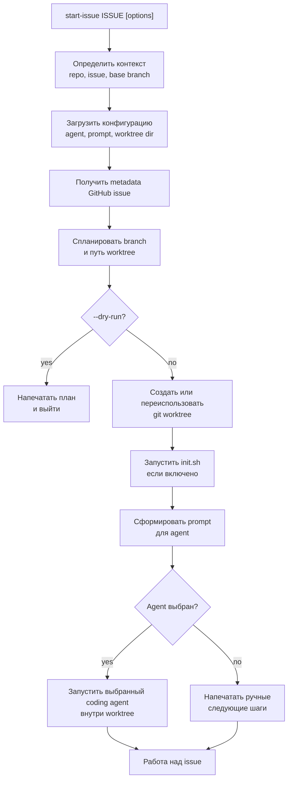

# start-issue

[](https://github.com/dapi/start-issue/actions/workflows/ci.yml)

[English version](README.md)

Превращайте GitHub issue в отдельную ветку, git worktree и сессию coding agent.

`start-issue` превращает контекст issue в повторяемый workflow:

1. issue -> branch
2. branch -> worktree
3. worktree -> agent session

Он получает данные issue через `gh`, создает git worktree с именем ветки на основе issue, при необходимости запускает `init.sh`, переименовывает текущую вкладку zellij и запускает настраиваемую сессию coding agent.

## Установка

```bash
make install
```

Команда устанавливает `scripts/start-issue` в `~/.local/bin/start-issue`.

Убедитесь, что `~/.local/bin` есть в вашем `PATH`.

## Использование

```bash
start-issue 123
start-issue https://github.com/owner/repo/issues/123
start-issue 123 --repo owner/repo --base develop
start-issue 123 --agent codex
start-issue 123 --agent kimi --prompt-file .start-issue/prompt.md
start-issue 123 --no-agent
start-issue 123 --dry-run
```

## Процесс



## Аргументы CLI

| Аргумент | Описание |
|----------|----------|
| `ISSUE` | Номер GitHub issue или полный URL GitHub issue. Обязательный аргумент. |
| `--repo OWNER/REPO`, `-r OWNER/REPO` | Репозиторий, из которого нужно прочитать issue, если `ISSUE` передан номером. Если не задан, `start-issue` определяет репозиторий из `origin`. |
| `--base BRANCH`, `-b BRANCH` | Базовая ветка для новой worktree branch. Если не задана, `start-issue` использует default branch репозитория, когда она доступна, иначе текущую ветку. |
| `--worktree-dir DIR`, `-w DIR` | Родительская директория для создаваемых worktree. Переопределяет `START_ISSUE_WORKTREE_DIR`. |
| `--flat` | Использовать плоский путь worktree, заменяя `/` в имени ветки на `-`. |
| `--agent AGENT` | Агент, который будет запущен после подготовки worktree. Поддерживаются: `claude`, `codex`, `kimi`, `pi`, `none`. |
| `--no-agent` | Подготовить worktree и напечатать ручные следующие шаги без запуска агента. Alias для `--agent none`. |
| `--no-claude` | Совместимый alias для `--no-agent`. |
| `--prompt TEXT` | Inline prompt template для выбранного агента. Нельзя использовать вместе с `--prompt-file`. |
| `--prompt-file PATH` | Файл prompt template для выбранного агента. Нельзя использовать вместе с `--prompt`. |
| `--no-init` | Не запускать `init.sh`, даже если он есть в созданном worktree. |
| `--command COMMAND`, `-c COMMAND` | Префикс Claude command для стандартного Claude prompt. Значение по умолчанию: `/task-router:route-task`. |
| `--ai` | Попросить выбранного агента сгенерировать имя ветки. Если генерация не удалась, используется локальная эвристика. |
| `--dry-run` | Напечатать выбранную конфигурацию и launch command без создания worktree, запуска `init.sh` или запуска агента. |
| `--version`, `-v` | Показать версию. |
| `--help`, `-h` | Показать справку. |

Подробные примеры по агентам находятся в [docs/agent-examples.md](docs/agent-examples.md).

Связанные Claude Code workflows из marketplace:

- [task-router](https://github.com/dapi/claude-code-marketplace/tree/master/task-router)
- [zellij-workflow](https://github.com/dapi/claude-code-marketplace/tree/master/zellij-workflow)

## Переменные окружения

| Переменная | Описание |
|------------|----------|
| `START_ISSUE_AGENT` | Агент по умолчанию, когда `--agent` не передан и agent не задан в файлах конфигурации. Поддерживаются: `claude`, `codex`, `kimi`, `pi`, `none`. Встроенное значение по умолчанию: `claude`. |
| `START_ISSUE_PROMPT` | Inline prompt template, который используется, если prompt не задан через CLI или файлы конфигурации. Нельзя использовать вместе с `START_ISSUE_PROMPT_FILE`, когда prompt берется из переменных окружения. |
| `START_ISSUE_PROMPT_FILE` | Файл prompt template, который используется, если prompt не задан через CLI или файлы конфигурации. Нельзя использовать вместе с `START_ISSUE_PROMPT`, когда prompt берется из переменных окружения. |
| `START_ISSUE_WORKTREE_DIR` | Родительская директория по умолчанию для создаваемых worktree, если `--worktree-dir` не передан. Встроенное значение по умолчанию: `~/worktrees`. |
| `START_ISSUE_DUMP_PROMPT` | Если задана в `1`, dry-run выводит полный rendered prompt вместо краткой информации. |

## Файлы конфигурации

| Файл | Описание |
|------|----------|
| `.start-issue/agent` | Агент по умолчанию для проекта. Читается из git root. |
| `.start-issue/prompt.md` | Prompt template по умолчанию для проекта. Читается из git root. |
| `~/.config/start-issue/agent` | Пользовательский agent по умолчанию. |
| `~/.config/start-issue/prompt.md` | Пользовательский prompt template по умолчанию. |

Приоритет конфигурации:

1. Аргументы CLI
2. Конфигурация проекта
3. Пользовательская конфигурация
4. Переменные окружения
5. Встроенные значения по умолчанию

Claude по умолчанию использует plugin-native команду:

```text
/task-router:route-task {ISSUE_URL}
```

Другие агенты по умолчанию используют portable prompt.

Prompt templates поддерживают:

```text
{ISSUE_URL}
{ISSUE_NUMBER}
{ISSUE_TITLE}
{ISSUE_BODY}
{ISSUE_LABELS}
{REPO}
{BRANCH_NAME}
{WORKTREE_PATH}
{BASE_BRANCH}
```

Неизвестные placeholders остаются без изменений.

## Требования

- `bash`
- `git`
- `gh` CLI с авторизованной GitHub session
- `jq`
- CLI выбранного агента, если не используется `--agent none`

## Спецификация

Спецификация скрипта находится в [docs/specs/start-issue-spec.md](docs/specs/start-issue-spec.md).

## Лицензия

MIT
