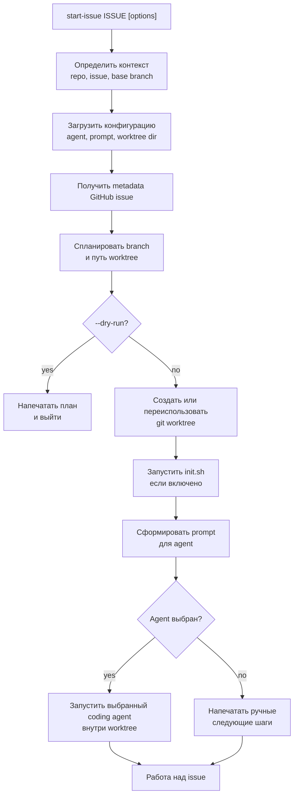

# start-issue

[](https://github.com/dapi/start-issue/actions/workflows/ci.yml)

[English version](README.md)

Превращайте GitHub issue в отдельную ветку, git worktree и сессию coding agent.

`start-issue` превращает контекст issue в повторяемый workflow:

1. issue -> branch
2. branch -> worktree
3. worktree -> agent session

Он получает данные issue через `gh`, создает git worktree с именем ветки на основе issue, при необходимости запускает `init.sh`, переименовывает текущую вкладку zellij и запускает настраиваемую сессию coding agent.

## Установка

```bash
make install
```

Команда устанавливает `scripts/start-issue` в `~/.local/bin/start-issue`.

Убедитесь, что `~/.local/bin` есть в вашем `PATH`.

## Использование

```bash
start-issue 123
start-issue https://github.com/owner/repo/issues/123
start-issue 123 --repo owner/repo --base develop
start-issue 123 --agent codex
start-issue 123 --agent kimi --prompt-file .start-issue/prompt.md
start-issue 123 --no-agent
start-issue 123 --dry-run
```

## Агенты

Поддерживаемые значения agent: `claude`, `codex`, `kimi`, `pi`, `none`.

Приоритет выбора agent:

1. CLI: `--agent codex`, `--no-agent` или legacy `--no-claude`
2. Project config: `.start-issue/agent` в git root
3. User config: `~/.config/start-issue/agent`
4. Environment: `START_ISSUE_AGENT`
5. Встроенное значение по умолчанию: `claude`

Claude остается агентом по умолчанию для обратной совместимости. `--no-claude` все еще работает как alias для `--no-agent`.

Связанные Claude Code workflows из marketplace:

- [task-router](https://github.com/dapi/claude-code-marketplace/tree/master/task-router)
- [zellij-workflow](https://github.com/dapi/claude-code-marketplace/tree/master/zellij-workflow)

## Примеры Агентов

### Claude

Claude является агентом по умолчанию, поэтому эти команды эквивалентны:

```bash
start-issue 123
start-issue 123 --agent claude
```

По умолчанию Claude получает repository-native команду task-router:

```text
/task-router:route-task {ISSUE_URL}
```

Используйте `--command`, чтобы сохранить стиль Claude slash-command, но заменить префикс команды:

```bash
start-issue 123 --agent claude --command "/debug"
```

Используйте project config, если Claude должен быть агентом по умолчанию для этого репозитория:

```bash
mkdir -p .start-issue
echo claude > .start-issue/agent
start-issue 123
```

### Codex

Запустить Codex для одного issue:

```bash
start-issue 123 --agent codex
```

Скрипт создает worktree, рендерит portable prompt и запускает:

```bash
codex --cd "$WORKTREE_PATH" --dangerously-bypass-approvals-and-sandbox "$PROMPT"
```

Использовать Codex как project default:

```bash
mkdir -p .start-issue
echo codex > .start-issue/agent
start-issue 123
```

Использовать custom prompt file с Codex:

```bash
start-issue 123 --agent codex --prompt-file .start-issue/prompt.md
```

### Kimi

Запустить Kimi для одного issue:

```bash
start-issue 123 --agent kimi
```

Скрипт создает worktree, рендерит portable prompt и запускает:

```bash
kimi --work-dir "$WORKTREE_PATH" --yolo -p "$PROMPT"
```

Использовать Kimi через environment, не меняя project files:

```bash
START_ISSUE_AGENT=kimi start-issue 123
```

Использовать inline prompt для одного запуска:

```bash
start-issue 123 --agent kimi --prompt "Implement {ISSUE_URL} in {WORKTREE_PATH}. Keep changes scoped and run tests."
```

### Pi

Запустить Pi для одного issue:

```bash
start-issue 123 --agent pi
```

Скрипт переходит в worktree и запускает:

```bash
cd "$WORKTREE_PATH"
pi "$PROMPT"
```

Использовать Pi как user default для всех репозиториев:

```bash
mkdir -p ~/.config/start-issue
echo pi > ~/.config/start-issue/agent
start-issue 123
```

Предварительно посмотреть, что именно будет выполнено перед запуском Pi:

```bash
start-issue 123 --agent pi --dry-run
```

## Настройка Prompt

Claude по умолчанию использует legacy plugin-native команду:

```text
/task-router:route-task {ISSUE_URL}
```

Другие агенты по умолчанию используют portable prompt. Launch prompt можно переопределить:

1. CLI: `--prompt-file path/to/prompt.md` или `--prompt "..."`
2. Project config: `.start-issue/prompt.md`
3. User config: `~/.config/start-issue/prompt.md`
4. Environment: `START_ISSUE_PROMPT_FILE` или `START_ISSUE_PROMPT`
5. Встроенное значение по умолчанию

Prompt templates поддерживают:

```text
{ISSUE_URL}
{ISSUE_NUMBER}
{ISSUE_TITLE}
{ISSUE_BODY}
{ISSUE_LABELS}
{REPO}
{BRANCH_NAME}
{WORKTREE_PATH}
{BASE_BRANCH}
```

Неизвестные placeholders остаются без изменений.

## Worktree Directory

Environment variable для default parent directory worktree: `START_ISSUE_WORKTREE_DIR`.

CLI `--worktree-dir` имеет самый высокий приоритет. Если ни CLI, ни environment variable не заданы, `start-issue` использует `~/worktrees`.

## Процесс



## Требования

- `bash`
- `git`
- `gh` CLI с авторизованной GitHub session
- `jq`
- CLI выбранного агента, если не используется `--agent none`

## Спецификация

Спецификация скрипта находится в [docs/specs/start-issue-spec.md](docs/specs/start-issue-spec.md).

## Лицензия

MIT
