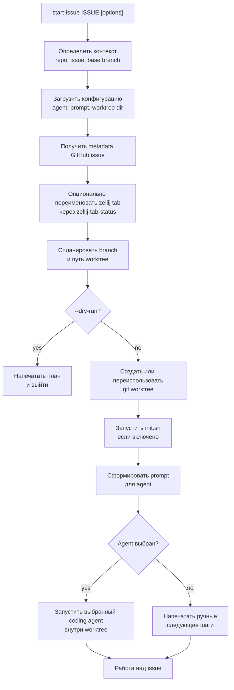

# start-issue

[](https://github.com/dapi/start-issue/actions/workflows/ci.yml)

[English version](README.md)

Превращайте GitHub issue в отдельную ветку, git worktree и сессию coding agent.

`start-issue` превращает контекст issue в повторяемый workflow:

1. issue -> branch
2. branch -> worktree
3. worktree -> agent session

Он получает данные issue через `gh`, создает git worktree с именем ветки на основе issue, при необходимости запускает `init.sh`, опционально переименовывает текущую вкладку zellij и запускает настраиваемую сессию coding agent.

## Установка

```bash
make install
```

Команда собирает self-contained `start-issue` из модульных исходников и устанавливает его в `~/.local/bin/start-issue`.

Убедитесь, что `~/.local/bin` есть в вашем `PATH`.

## Использование

```bash
start-issue 123
start-issue https://github.com/owner/repo/issues/123
start-issue 123 --repo owner/repo --base develop
start-issue 123 --agent codex
start-issue 123 --agent kimi --prompt-file .start-issue/prompt.md
start-issue 123 --no-agent
start-issue 123 --dry-run
start-issue init
```

Запуск `start-issue` без issue печатает обычную справку, а также текущий
выбранный agent, источник prompt, расположение prompt и короткий preview prompt,
после чего выходит без обращения к GitHub.

## Процесс


```mermaid
flowchart TD
    A["start-issue ISSUE [options]"] --> B["Определить контекст<br/>repo, issue, base branch"]
    B --> C["Загрузить конфигурацию<br/>agent, prompt, worktree dir"]
    C --> D["Получить metadata GitHub issue"]
    D --> Z["Опционально переименовать zellij tab<br/>через zellij-tab-status"]
    Z --> E["Спланировать branch<br/>и путь worktree"]
    E --> F{"--dry-run?"}

    F -- yes --> G["Напечатать план<br/>и выйти"]
    F -- no --> H["Создать или переиспользовать<br/>git worktree"]

    H --> I["Запустить init.sh<br/>если включено"]
    I --> J["Сформировать prompt<br/>для agent"]
    J --> K{"Agent выбран?"}

    K -- yes --> L["Запустить выбранный coding agent<br/>внутри worktree"]
    K -- no --> M["Напечатать ручные<br/>следующие шаги"]

    L --> N["Работа над issue"]
    M --> N
```

## Внутренняя архитектура

CLI entrypoint остается `scripts/start-issue`, но реализация теперь разбита на специализированные shell-модули в `scripts/lib/start_issue/`.
`make build` и `make install` собирают эти модули обратно в single-file script для дистрибуции и локальной установки.

- `cli.sh` парсит аргументы и нормализует флаги в состояние workflow.
- `config.sh` разрешает конфигурацию agent и prompt.
- `github.sh` определяет контекст репозитория и получает metadata issue.
- `worktree.sh` планирует поведение branch/worktree и выполняет worktree-side effects.
- `agent.sh` владеет операциями agent adapter: validation, сборка launch command, AI branch naming и prompt improvement.
- `output.sh` рендерит help, status, dry-run output и session framing.
- `init.sh` владеет `start-issue init`.
- `pipeline.sh` делает orchestration pipeline явным.

Внутренний pipeline теперь такой:

1. Parse input.
2. Resolve config.
3. Fetch issue.
4. Plan branch and worktree.
5. Execute the plan.
6. Launch the selected agent.

Bash стоит сохранять, пока lifecycle commands, shape конфигурации и требования к output остаются достаточно простыми для читаемых shell-модулей. Если будущие задачи потребуют nested configuration, более богатых subcommands вроде `resume` или `cleanup`, или структурированного machine-readable output, это следует считать порогом для оценки Python core.

## Аргументы CLI

| Аргумент | Описание |
|----------|----------|
| `ISSUE` | Номер GitHub issue или полный URL GitHub issue. Обязательный аргумент. |
| `init` | Создать файлы конфигурации по умолчанию для текущего проекта или текущего пользователя. |
| `--repo OWNER/REPO`, `-r OWNER/REPO` | Репозиторий, из которого нужно прочитать issue, если `ISSUE` передан номером. Если не задан, `start-issue` определяет репозиторий из `origin`. |
| `--base BRANCH`, `-b BRANCH` | Базовая ветка для новой worktree branch. Если не задана, `start-issue` использует default branch репозитория, когда она доступна, иначе текущую ветку. |
| `--worktree-dir DIR`, `-w DIR` | Родительская директория для создаваемых worktree. Переопределяет `START_ISSUE_WORKTREE_DIR`. |
| `--flat` | Использовать плоский путь worktree, заменяя `/` в имени ветки на `-`. |
| `--agent AGENT` | Агент, который будет запущен после подготовки worktree. С `init` - agent по умолчанию, который нужно записать. Поддерживаются: `claude`, `codex`, `kimi`, `pi`, `none`. |
| `--no-agent` | Подготовить worktree и напечатать ручные следующие шаги без запуска агента. Alias для `--agent none`. |
| `--no-claude` | Совместимый alias для `--no-agent`. |
| `--prompt TEXT` | Inline prompt template для выбранного агента. С `init` - prompt template, который нужно записать. Нельзя использовать вместе с `--prompt-file`. |
| `--prompt-file PATH` | Файл prompt template для выбранного агента. С `init` - содержимое файла, которое нужно записать. Нельзя использовать вместе с `--prompt`. |
| `--improve-prompt` | Попросить выбранного агента сгенерировать reviewable proposal улучшенного prompt template и выйти до создания worktree. |
| `--prompt-output-file PATH` | Путь для proposal-файла в режиме `--improve-prompt`. |
| `--no-init` | Не запускать `init.sh`, даже если он есть в созданном worktree. |
| `--command COMMAND`, `-c COMMAND` | Префикс Claude command для стандартного Claude prompt. Значение по умолчанию: `/task-router:route-task`. |
| `--ai` | Попросить выбранного агента сгенерировать имя ветки. Если генерация не удалась, используется локальная эвристика. |
| `--project` | С `init` - записать проектную конфигурацию в `.start-issue` в git root. |
| `--user` | С `init` - записать пользовательскую конфигурацию в `~/.config/start-issue`. |
| `--force` | С `init` - перезаписать существующие файлы `agent` и `prompt.md`. По умолчанию существующие файлы сохраняются. |
| `--dry-run` | Напечатать выбранную конфигурацию и launch command без создания worktree, запуска `init.sh` или запуска агента. С `init` - напечатать план записи конфигурации без создания файлов. |
| `--version`, `-v` | Показать версию. |
| `--help`, `-h` | Показать справку. |

Подробные примеры по агентам находятся в [docs/agent-examples.ru.md](docs/agent-examples.ru.md).

Связанные Claude Code workflows из marketplace:

- [task-router](https://github.com/dapi/claude-code-marketplace/tree/master/task-router)
- [zellij-workflow](https://github.com/dapi/claude-code-marketplace/tree/master/zellij-workflow)

## Переменные окружения

| Переменная | Описание |
|------------|----------|
| `START_ISSUE_AGENT` | Агент по умолчанию, когда `--agent` не передан и agent не задан в файлах конфигурации. Поддерживаются: `claude`, `codex`, `kimi`, `pi`, `none`. Встроенное значение по умолчанию: `claude`. |
| `START_ISSUE_PROMPT` | Inline prompt template, который используется, если prompt не задан через CLI. Перебивает project и user prompt files. Нельзя использовать вместе с `START_ISSUE_PROMPT_FILE`, когда prompt не задан через CLI. |
| `START_ISSUE_PROMPT_FILE` | Файл prompt template, который используется, если prompt не задан через CLI. Перебивает project и user prompt files. Нельзя использовать вместе с `START_ISSUE_PROMPT`, когда prompt не задан через CLI. |
| `START_ISSUE_WORKTREE_DIR` | Родительская директория по умолчанию для создаваемых worktree, если `--worktree-dir` не передан. Встроенное значение по умолчанию: `~/worktrees`. |
| `START_ISSUE_DUMP_PROMPT` | Если задана в `1`, dry-run выводит полный rendered prompt вместо краткой информации. |

## Файлы конфигурации

| Файл | Описание |
|------|----------|
| `.start-issue/agent` | Агент по умолчанию для проекта. Читается из git root. |
| `.start-issue/prompt.md` | Prompt template по умолчанию для проекта. Читается из git root. |
| `~/.config/start-issue/agent` | Пользовательский agent по умолчанию. |
| `~/.config/start-issue/prompt.md` | Пользовательский prompt template по умолчанию. |

Запустите `start-issue init`, чтобы создать эти файлы. Если не переданы `--project` или `--user`, команда спросит, какой scope инициализировать. Она записывает встроенные agent и prompt по умолчанию, если не переданы `--agent`, `--prompt` или `--prompt-file`. Если существующий файл `agent` сохраняется без `--force`, default prompt выбирается для этого сохраненного agent.

Приоритет конфигурации:

1. Аргументы CLI
2. Конфигурация проекта
3. Пользовательская конфигурация
4. Переменные окружения
5. Встроенные значения по умолчанию

Claude по умолчанию использует plugin-native команду:

```text
/task-router:route-task {ISSUE_URL}
```

Другие агенты по умолчанию используют portable prompt.

Чтобы улучшить prompt template, который будет использоваться для будущих стартов разработки, запустите:

```bash
start-issue 123 --agent codex --improve-prompt
```

Команда выбирает активный prompt template по обычному приоритету, получает issue как контекст, просит выбранного агента вернуть полный улучшенный prompt template и записывает proposal-файл. Активный prompt не перезаписывается. Для prompt-файлов proposal по умолчанию создается рядом с источником как `*.improved.md`; для built-in и inline prompt используется `.start-issue/prompt.improved.md`. Используйте `--prompt-output-file`, чтобы указать другой путь.

Prompt templates поддерживают:

```text
{ISSUE_URL}
{ISSUE_NUMBER}
{ISSUE_TITLE}
{ISSUE_BODY}
{ISSUE_LABELS}
{REPO}
{BRANCH_NAME}
{WORKTREE_PATH}
{BASE_BRANCH}
```

Неизвестные placeholders остаются без изменений.

## Поддержка Zellij

Если [`zellij-tab-status`](https://github.com/dapi/zellij-tab-status) доступен в `PATH`, `start-issue` после получения issue переименовывает текущую вкладку Zellij в `#ISSUE_NUMBER` через `zellij-tab-status --set-name`.

Этот шаг опциональный. Отсутствие `zellij-tab-status` игнорируется, а ошибка переименования выводится как предупреждение и не останавливает workflow.

Опциональная зависимость для поддержки Zellij:

- [`zellij-tab-status`](https://github.com/dapi/zellij-tab-status)

## Требования

- `bash`
- `git`
- `gh` CLI с авторизованной GitHub session
- `jq`
- CLI выбранного агента, если не используется `--agent none` или `--dry-run`

## Спецификация

Спецификация скрипта находится в [doc/spec.md](doc/spec.md).

## Лицензия

MIT
