# start-issue Workflow

```mermaid
flowchart TD
    A["start-issue ISSUE [options]"] --> B["Parse CLI arguments"]
    B --> C["Check core dependencies: git, gh, jq"]
    C --> D["Verify gh auth and current git repository"]
    D --> E["Detect project root with git rev-parse --show-toplevel"]
    E --> F["Parse issue input"]

    F --> G{"Input is full GitHub issue URL?"}
    G -- yes --> H["Extract repo and issue number from URL"]
    G -- no --> I["Use issue number from CLI"]
    I --> J{"--repo provided?"}
    J -- yes --> K["Use CLI repo"]
    J -- no --> L["Detect repo from origin remote"]
    H --> M["Detect base branch"]
    K --> M
    L --> M

    M --> N["Resolve selected agent"]
    N --> N1["1. CLI --agent / --no-agent"]
    N1 --> N2["2. .start-issue/agent"]
    N2 --> N3["3. ~/.config/start-issue/agent"]
    N3 --> N4["4. START_ISSUE_AGENT"]
    N4 --> N5["5. default claude"]
    N5 --> O{"Agent is valid?"}
    O -- no --> X["Exit with error"]
    O -- yes --> P["Resolve prompt template"]

    P --> P1["1. CLI --prompt-file / --prompt"]
    P1 --> P2["2. .start-issue/prompt.md"]
    P2 --> P3["3. ~/.config/start-issue/prompt.md"]
    P3 --> P4["4. START_ISSUE_PROMPT_FILE / START_ISSUE_PROMPT"]
    P4 --> P5["5. built-in default"]
    P5 --> Q["Fetch issue metadata with gh api"]

    Q --> R["Try zellij tab rename helper"]
    R --> S{"--ai branch naming?"}
    S -- no --> T["Generate branch name with bash heuristic"]
    S -- yes --> U["Ask selected agent for branch name"]
    U --> V{"Valid branch name returned?"}
    V -- yes --> W["Use AI branch name"]
    V -- no --> T
    T --> Y["Compute worktree path"]
    W --> Y

    Y --> Y1["Worktree dir priority: --worktree-dir, START_ISSUE_WORKTREE_DIR, ~/worktrees"]
    Y1 --> Z{"Branch or path already exists?"}
    Z -- yes --> Z1["Prompt: use existing, create versioned branch, recreate, or exit"]
    Z -- no --> AA["Create git worktree"]
    Z1 --> AA

    AA --> AB{"--no-init?"}
    AB -- yes --> AD["Skip init.sh"]
    AB -- no --> AC{"init.sh exists?"}
    AC -- yes --> AC1["Run init.sh in worktree"]
    AC -- no --> AD
    AC1 --> AE["Render prompt variables"]
    AD --> AE

    AE --> AF{"Selected agent"}
    AF -- claude --> AG["cd worktree && claude --dangerously-skip-permissions PROMPT"]
    AF -- codex --> AH["codex --cd worktree --dangerously-bypass-approvals-and-sandbox PROMPT"]
    AF -- kimi --> AI["kimi --work-dir worktree --yolo -p PROMPT"]
    AF -- pi --> AJ["cd worktree && pi PROMPT"]
    AF -- none --> AK["Print manual next steps"]

    AG --> AL["Interactive agent session"]
    AH --> AL
    AI --> AL
    AJ --> AL
    AK --> AM["Done"]
    AL --> AM

    B -. "--dry-run" .-> DR["Print selected agent, prompt source, worktree command, and launch command without mutating worktree or launching agent"]
```

## Data Precedence Summary

Agent:

1. CLI `--agent`, `--no-agent`, `--no-claude`
2. `.start-issue/agent`
3. `~/.config/start-issue/agent`
4. `START_ISSUE_AGENT`
5. `claude`

Prompt:

1. CLI `--prompt-file` or `--prompt`
2. `.start-issue/prompt.md`
3. `~/.config/start-issue/prompt.md`
4. `START_ISSUE_PROMPT_FILE` or `START_ISSUE_PROMPT`
5. built-in default

Worktree directory:

1. CLI `--worktree-dir`
2. `START_ISSUE_WORKTREE_DIR`
3. `~/worktrees`
