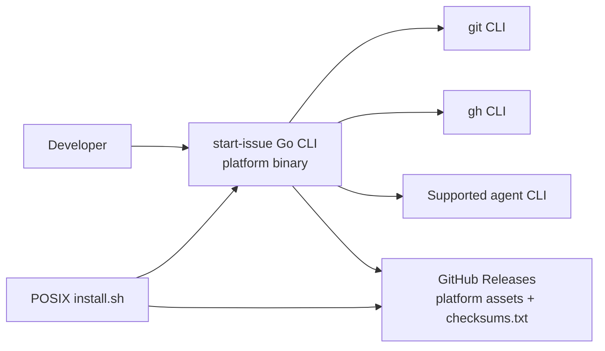

# FT-017: Design

## Design Pack

| Artifact | Role | Owns |
| --- | --- | --- |
| `design.md` | Feature-local solution owner | `SOL-*`, `C4-*`, `SD-*`, `CTR-*`, `INV-*`, `FM-*`, `RB-*` |
| `decision-log.md` | Decision reference | `DL-01` distribution decision and `DL-02` toolchain/Windows-update boundary |

## Context

The former Bash implementation was modularized by responsibility but bundled into a single script. The Go migration preserves its documented behavior while replacing the runtime, test stack, and release-artifact boundary. The selected distribution contract is `DL-01`.

## C4 Applicability

| C4 ID | Decision | Trigger / reason | Artifact |
| --- | --- | --- | --- |
| `C4-02` | `C2` | Go replaces the executable runtime and introduces target-specific release artifacts, installer asset selection, and updater downloads across the GitHub Release boundary. | C2 view below |

### C4 Artifact

`C4-02` covers the changed runtime/distribution boundary. `git`, `gh`, and agent CLIs remain external processes in the initial migration (`REQ-03`).

## Selected Solution

- `SOL-01` Create module `github.com/dapi/start-issue` with Go `1.21` and public command entrypoint `cmd/start-issue`; separate Go packages by the existing responsibility boundaries: CLI/input, config/prompt, repository/GitHub, worktree, agent adapters, update/release, output, and orchestration.
- `SOL-02` Use Go standard process execution and filesystem APIs to preserve the shell-oriented integrations with `git`, `gh`, and agent CLIs; do not introduce native GitHub or agent API clients.
- `SOL-03` Port deterministic regression coverage to Go tests using fake command boundaries. Cover the documented observable behavior without retaining a Bash or Bats runtime dependency.
- `SOL-04` Make Go the default build/install/release runtime and remove the Bash runtime and Bats suite.
- `SOL-05` Use GoReleaser v2 under `DL-01` to publish `start-issue-linux-amd64`, `start-issue-linux-arm64`, `start-issue-darwin-amd64`, `start-issue-darwin-arm64`, and `start-issue-windows-amd64.exe`, plus SHA-256 `checksums.txt`.
- `SOL-06` Adapt `install.sh` for POSIX platform detection and checksum verification; document Windows manual asset/PATH installation. On Linux/macOS, self-update resolves and verifies the named asset before replacement; on Windows it prints the matching manual-update instruction instead of overwriting the running `.exe`.

## Alternatives Considered

| Alternative ID | Option | Why not selected |
| --- | --- | --- |
| `ALT-01` | Rewrite the CLI and replace Bash immediately | Contradicts `NS-03` and leaves no executable parity oracle. |
| `ALT-02` | Native Go GitHub/agent integrations | Contradicts `REQ-03` and broadens the migration beyond parity. |
| `ALT-03` | One release asset for all Go platforms | Impossible for compiled platform-specific executables; rejected by `DL-01`. |

## Trade-offs

| Trade-off ID | Decision | Benefit | Cost / Risk |
| --- | --- | --- | --- |
| `TRD-01` | Retain Bash during migration | A concrete parity oracle and reversible cutover | Temporary duplicate implementation and test maintenance |
| `TRD-02` | Publish five Go assets | Explicit coverage for the selected platforms | Installer/update and CI matrix become more complex |

## Accepted Local Decisions

- `SD-01` The Go package boundaries mirror existing Bash responsibility boundaries, but are not required to reproduce shell-file structure one-for-one.
- `SD-02` Parity evaluates observable behavior, not internal command implementation or byte-for-byte formatting where outputs contain nondeterministic paths/timestamps; normalizers must be case-local and documented.
- `SD-03` An intentional difference is valid only when it has a stable case ID, user-visible rationale, acceptance approval in this feature package, and a corresponding parity expectation; an unexplained mismatch fails `CHK-01`.
- `SD-04` Windows is a first-class binary release target, while manual download/PATH setup is the initial installation path; POSIX `install.sh` is not represented as Windows support.
- `SD-05` Go `1.21` is the fixed local/CI/release toolchain baseline for this feature, following the selected reference release strategy.
- `SD-06` Windows `update` is an explicit manual-update path in the first release rather than a self-replacing executable path.

## Contracts

| Contract ID | Input / Output | Producer / Consumer | Semantics / Constraints |
| --- | --- | --- | --- |
| `CTR-01` | Same deterministic case input → baseline and Go results | parity harness / reviewer | Compare exit code, normalized output, fake CLI log, and planned filesystem state; each difference must map to an approved case expectation. |
| `CTR-02` | CLI invocation → external process commands | Go adapter / `git`, `gh`, agent CLI | Preserve existing command semantics, working directory, input flow, and failure handling covered by parity cases. |
| `CTR-03` | OS/arch → named asset + checksum or manual instruction | installer/updater / GitHub Release | POSIX installer/updater select only `DL-01` targets, verify SHA-256 from `checksums.txt`, and reject unsupported platforms before replacement. Windows selects `start-issue-windows-amd64.exe` only for the manual install/update instruction. |
| `CTR-04` | tag/version → build metadata | GoReleaser / `start-issue --version` | Embed the release version so the existing version output contract remains verifiable after installation/update. |

## Invariants

- `INV-01` The public executable and regression test stack contain no repository-owned Bash runtime or Bats dependency.
- `INV-02` No parity mismatch can be hidden by a normalizer, broad snapshot rewrite, or undocumented tolerance.
- `INV-03` Release asset selection and checksum verification occur before an installer or updater replaces an executable.
- `INV-04` `git`, `gh`, and agent CLIs remain process boundaries in this migration.

## Failure Modes

- `FM-01` A behavior mismatch is mistaken for parity because a fixture lacks the relevant side effect or normalizes meaningful output.
- `FM-02` A POSIX installer/updater fetches a valid checksum for the wrong platform asset or attempts an unsupported OS/architecture.
- `FM-03` Go becomes the default distribution before parity and compatibility checks are green.
- `FM-04` Windows is advertised as automatic installer/updater-supported even though its initial contract is binary/manual setup and update.

## Rollout / Backout

| Stage ID | Stage | Entry condition | Backout |
| --- | --- | --- | --- |
| `RB-01` | Parallel implementation | Go command and parity harness are present; Bash remains default | Keep/revert to Bash-only build and distribution; preserve cases as baseline evidence. |
| `RB-02` | Default-runtime cutover | `CHK-01` and `CHK-02` pass; Go is built by `make build` and selected by install/release paths | Restore Bash build/install/release paths and keep the Go code and failing evidence for correction. |
| `RB-03` | Multi-platform release | `CHK-03` passes for every `DL-01` target | Do not publish the tag/release; retain the prior published release. |

## Traceability

| Requirement ID | Solution refs | Contracts / invariants | Failure / rollout refs |
| --- | --- | --- | --- |
| `REQ-01` | `SOL-01`, `SOL-04` | `CTR-01`, `INV-01` | `FM-01`, `FM-03`, `RB-01`, `RB-02` |
| `REQ-02` | `SOL-01`, `SOL-03`, `SOL-04` | `CTR-01`, `INV-02` | `FM-01`, `FM-03`, `RB-01`, `RB-02` |
| `REQ-03` | `SOL-02` | `CTR-02`, `INV-04` | `FM-01` |
| `REQ-04` | `SOL-03` | `CTR-01`, `INV-02` | `FM-01`, `RB-01` |
| `REQ-05` | `SOL-05`, `SOL-06` | `CTR-03`, `CTR-04`, `INV-03` | `FM-02`, `FM-04`, `RB-02`, `RB-03` |
