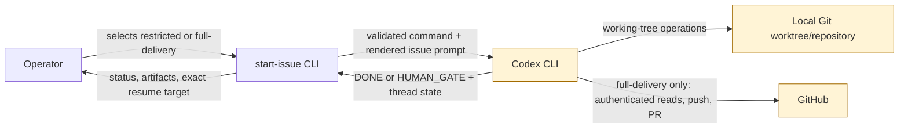

# FT-017: Design

## Design Pack

| Artifact | Role | Owns |
| --- | --- | --- |
| `design.md` | Feature-local solution owner | `SOL-*`, `ALT-*`, `TRD-*`, `C4-*`, `SD-*`, `CTR-*`, `INV-*`, `FM-*`, `RB-*` |

## Context

FT-015 owns the batch/resume lifecycle. FT-017 changes only the launcher
capability boundary around that lifecycle. The solution must keep restricted
behavior safe by default while giving an operator one deliberate, visible way
to authorize end-to-end Git delivery.

Issue #37 reproduces the obsolete `--ask-for-approval` placement with Codex
`0.144.6`. The current upstream Codex `exec` source exposes
`--dangerously-bypass-approvals-and-sandbox` as a global option and keeps the
JSONL/last-message contract on `exec`. The design therefore owns a semantic
contract rather than passing arbitrary Codex arguments; the exact approved
release remains a live-verification concern.

## C4 Applicability

| C4 ID | Decision | Trigger / reason | Artifact |
| --- | --- | --- | --- |
| `C4-01` | `C1` | Full-delivery mode changes the trust boundary between the operator, `start-issue`, Codex, the local Git repository, and GitHub. | Mermaid system-context diagram below |

### C4 Artifact

The operator's explicit mode selection is the authorization boundary.
`start-issue` validates and renders the policy; Codex executes it; GitHub still
enforces credentials and repository authorization independently.

## Selected Solution

- `SOL-01` Add one semantic configuration axis named human-gate permissions
  with exactly two values: `restricted` and `full-delivery`. Resolve it as CLI
  option → environment variable → built-in `restricted`.
- `SOL-02` Keep `restricted` on the existing `--sandbox workspace-write`
  command and map explicit `full-delivery` to the global
  `--dangerously-bypass-approvals-and-sandbox` option.
- `SOL-03` Build the command in supported grammar order: `codex`, global model
  and permission options, `exec`, then worktree and batch-output options.
- `SOL-04` Print the resolved semantic mode and a concise capability statement
  in dry-run and immediately before batch execution. Full-delivery output also
  prints a high-signal warning before Codex starts.
- `SOL-05` Keep FT-015's prompt, run-state, thread-id, status parser, exit codes,
  and resume path unchanged. The selected permission mode applies to the batch
  run; interactive resume remains a human-controlled transition.
- `SOL-06` Extend the opt-in real-Codex E2E runner with a separately authorized
  full-delivery scenario that uses isolated fixture resources and retains
  delivery evidence.

## Alternatives Considered

| Alternative ID | Option | Why not selected |
| --- | --- | --- |
| `ALT-01` | Pass arbitrary extra Codex arguments from CLI or environment | Makes validation, documentation, shell quoting, and safety review unreliable. |
| `ALT-02` | Require a named Codex profile and infer capabilities from it | `start-issue` cannot reliably prove the effective network/Git permissions of an arbitrary external profile, so the advertised contract could be false. |
| `ALT-03` | Make full delivery the new default | Silently broadens privileges for existing automation and violates `CON-01`. |
| `ALT-04` | Keep only `workspace-write` and document manual delivery | Does not satisfy the explicit end-to-end delivery outcome in `REQ-02`. |

## Trade-offs

| Trade-off ID | Decision | Benefit | Cost / Risk |
| --- | --- | --- | --- |
| `TRD-01` | Expose two semantic modes instead of raw Codex controls | Small, testable public contract with stable operator meaning | Advanced Codex policies are not expressible through this feature. |
| `TRD-02` | Use the explicit Codex bypass option for full delivery | Covers the approvals and sandbox boundaries implicated by issue #37 | Batch commands are unsandboxed and must be treated as high risk. |
| `TRD-03` | Use the explicit bypass mode for unattended batch execution | Preserves unattended human-gate semantics for the selected full-delivery mode | Capability errors cannot escalate mid-run and must be diagnosed clearly. |

## Accepted Local Decisions

- `SD-01` Name the public values by user outcome (`restricted`,
  `full-delivery`) rather than Codex implementation names so help and future
  adapters can describe capability without leaking every low-level flag.
- `SD-02` Use `--human-gate-permissions VALUE` and
  `START_ISSUE_HUMAN_GATE_PERMISSIONS` as the two explicit inputs. Project/user
  persistence is deferred; the dangerous mode must not become an unnoticed
  repository default in this feature.
- `SD-03` A full-delivery selection is itself explicit authorization to launch
  the unsandboxed batch command, but not authorization for destructive or
  production actions excluded by `NS-03`.
- `SD-04` Live full-delivery verification remains a manual approval gate and is
  never folded into `make test` or CI.

## Contracts

| Contract ID | Input / Output | Producer / Consumer | Semantics / Constraints |
| --- | --- | --- | --- |
| `CTR-01` | `--human-gate-permissions restricted\|full-delivery` | CLI parser / config resolver | CLI value wins over environment; it requires `--human-gate`; invalid or empty explicit values fail before issue fetch. |
| `CTR-02` | `START_ISSUE_HUMAN_GATE_PERMISSIONS` | shell environment / config resolver | Used only when CLI input is absent; unset resolves to `restricted`. |
| `CTR-03` | Restricted Codex command | launcher / Codex | `codex [--model MODEL] exec --cd WORKTREE --sandbox workspace-write --json --output-last-message PATH -`. |
| `CTR-04` | Full-delivery Codex command | launcher / Codex | `codex [--model MODEL] --dangerously-bypass-approvals-and-sandbox exec --cd WORKTREE --json --output-last-message PATH -`; selected only by explicit `full-delivery`. |
| `CTR-05` | Permission status output | launcher / operator | Reports semantic mode and capability boundary before execution and in dry-run; full delivery includes an unsandboxed-execution warning. |

## Invariants

- `INV-01` Absence of configuration always resolves to `restricted`.
- `INV-02` Only `restricted` and `full-delivery` are accepted; no value is
  interpolated directly into a shell command.
- `INV-03` Full-delivery selection never injects credentials or secret values.
- `INV-04` Batch commands remain arrays and are never evaluated through `eval`.
- `INV-05` FT-015's exact thread-id resume and state-artifact paths remain
  stable across permission modes.

## Failure Modes

- `FM-01` Codex changes option grammar: deterministic command assertions or the
  real-Codex smoke run fails before the feature is accepted; update the adapter
  and supported-version documentation together.
- `FM-02` Full delivery lacks GitHub authentication or repository permission:
  preserve run artifacts and report an operational capability failure rather
  than treating it as a product-choice `HUMAN_GATE`.
- `FM-03` An invalid permission value is supplied: reject it before fetching an
  issue, creating/reusing a worktree, or invoking Codex.
- `FM-04` A full-delivery prompt proposes destructive or production work:
  prompt policy still requires `STATUS: HUMAN_GATE`; permission mode does not
  broaden product authorization.

## Rollout / Backout

| Stage ID | Stage | Entry condition | Backout |
| --- | --- | --- | --- |
| `RB-01` | Ship restricted/default path and deterministic tests | Command contract passes `make test`; docs state restricted boundary | Remove the new input while retaining FT-015's existing restricted command |
| `RB-02` | Document and enable explicit full delivery | Warning, negative tests, and command-shape coverage pass | Reject `full-delivery` and keep `restricted` available |
| `RB-03` | Validate live fixture delivery | Explicit operator approval and isolated fixture repo/issue are available | Stop the E2E, retain artifacts, and leave feature not-done |

## ADR / External Design Dependencies

No cross-feature architecture decision is introduced. The permission mapping is
feature-local and can be revised with this design if the supported Codex CLI
contract changes.

## Traceability

| Requirement ID | Solution refs | Contracts / invariants | Failure / rollout refs |
| --- | --- | --- | --- |
| `REQ-01` | `SOL-01`, `SOL-04`, `SD-01` | `CTR-01` - `CTR-03`, `CTR-05`, `INV-01` | `FM-03`, `RB-01` |
| `REQ-02` | `SOL-01`, `SOL-02`, `TRD-02`, `SD-03` | `CTR-04`, `CTR-05`, `INV-02`, `INV-03` | `FM-02`, `FM-04`, `RB-02` |
| `REQ-03` | `SOL-01`, `SD-02` | `CTR-01`, `CTR-02`, `INV-01`, `INV-02` | `FM-03`, `RB-01` |
| `REQ-04` | `SOL-02`, `SOL-03` | `CTR-03`, `CTR-04`, `INV-04` | `FM-01`, `RB-01`, `RB-02` |
| `REQ-05` | `SOL-05` | `INV-05` | `RB-01` |
| `REQ-06` | `SOL-04`, `TRD-02`, `SD-03` | `CTR-05`, `INV-03` | `FM-02`, `FM-04`, `RB-02` |
| `REQ-07` | `SOL-01` - `SOL-05` | `CTR-01` - `CTR-05`, `INV-01` - `INV-05` | `FM-01` - `FM-04`, `RB-01`, `RB-02` |
| `REQ-08` | `SOL-06`, `SD-04` | `INV-03`, `INV-05` | `FM-02`, `RB-03` |
